---
## Front matter
title: "Лабораторная работа № 3. Настройка DHCP-сервера."
subtitle: "Отчет"
author: "Анна Александровна Глушенок"

## Generic options
lang: ru-RU
toc-title: "Содержание"

## Pdf output format
toc: true
toc-depth: 2
lof: true
lot: false
fontsize: 12pt
linestretch: 1.5
papersize: a4
documentclass: scrreprt

## I18n babel
babel-lang: russian
babel-otherlangs: english

## Fonts
mainfont: Liberation Serif
sansfont: Liberation Sans
monofont: Liberation Mono

## Pandoc-crossref LaTeX customization
figureTitle: "Рис."
tableTitle: "Таблица"
lofTitle: "Список иллюстраций"

## Misc options
indent: true
header-includes:
  - \usepackage{indentfirst}
  - \usepackage{float}
  - \floatplacement{figure}{H}
---

# Цель работы

Приобретение практических навыков по установке и конфигурированию DHCP-сервера.

# Задание

1. Установите на виртуальной машине server DHCP-сервер (см. раздел 3.4.1).
2. Настройте виртуальную машину server в качестве DHCP-сервера для виртуальной
внутренней сети (см. раздел 3.4.2).
3. Проверьте корректность работы DHCP-сервера в виртуальной внутренней сети
путём запуска виртуальной машины client и применения соответствующих утилит
диагностики (см. раздел 3.4.3).
4. Настройте обновление DNS-зоны при появлении в виртуальной внутренней сети
новых узлов (см. раздел 3.4.4).
5. Проверьте корректность работы DHCP-сервера и обновления DNS-зоны в виртуаль-
ной внутренней сети путём запуска виртуальной машины client и применения
соответствующих утилит диагностики (см. раздел 3.4.5).
6. Напишите скрипт для Vagrant, фиксирующий действия по установке и настройке
DHCP-сервера во внутреннем окружении виртуальной машины server. Соответ-
ствующим образом внести изменения в Vagrantfile (см. раздел 3.4.6).

# Выполнение лабораторной работы

## Установка DHCP-сервера

1. Установите dhcp: dnf -y install kea

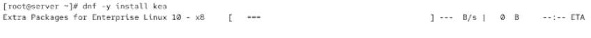{#fig:001 width=60%}

## Конфигурирование DHCP-сервера

1. Сохраните на всякий случай конфигурационный файл
2. Откройте файл /etc/kea/kea-dhcp4.conf на редактирование. Поочередно вносим изменения. 

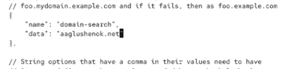{#fig:003 width=60%}

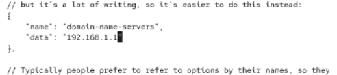{#fig:004 width=60%}

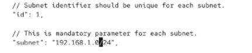{#fig:005 width=60%}

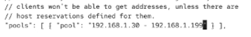{#fig:006 width=60%}

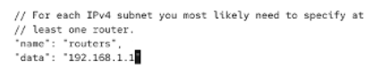{#fig:007 width=60%}

3. Настройте привязку dhcpd к интерфейсу eth1 виртуальной машины server:

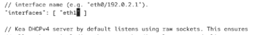{#fig:008 width=60%}

4. Проверьте правильность конфигурационного файла

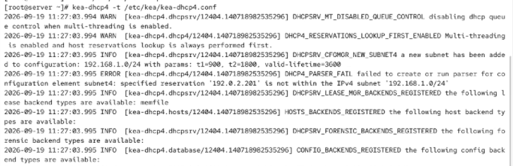{#fig:009 width=60%}

5. Перезагрузите конфигурацию dhcpd и разрешите загрузку DHCP-сервера при запуске виртуальной машины server:

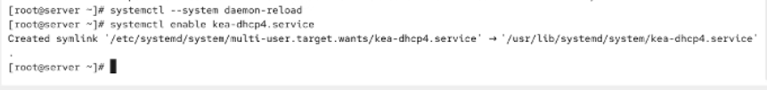{#fig:010 width=60%}

6. Добавьте запись для DHCP-сервера в конце файла прямой DNS-зоны и в конце файла обратной зоны, измените серийный номер файла зоны

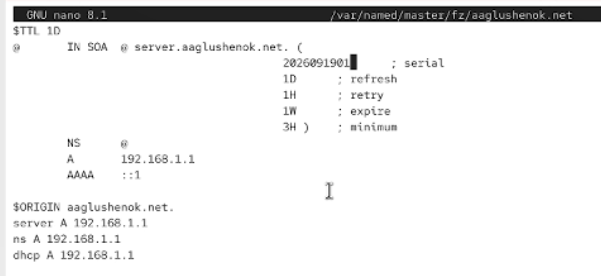{#fig:011 width=60%}

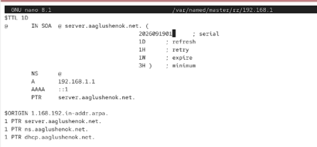{#fig:012 width=60%}

7. Перезапустите named
8. Проверьте, что можно обратиться к DHCP-серверу по имени:

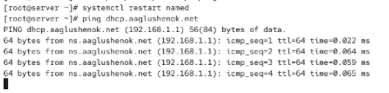{#fig:013 width=60%}

9. Внесите изменения в настройки межсетевого экрана узла server, разрешив работу с DHCP

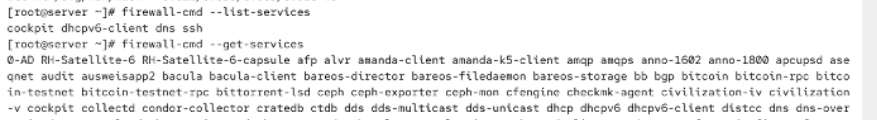{#fig:014 width=60%}

{#fig:015 width=60%}

10. Восстановите контекст безопасности в SELinux:

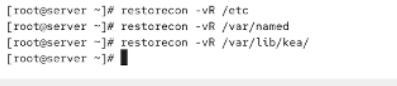{#fig:017 width=60%}

11. В дополнительном терминале запустите мониторинг происходящих в системе процессов в реальном времени
12. В основном рабочем терминале запустите DHCP-сервер
13. Если запуск DHCP-сервера прошёл успешно, то не выключая виртуальной машины приступите к анализу работы DHCP-сервера на клиенте

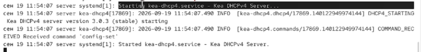{#fig:018 width=60%}

## Анализ работы DHCP-сервера

1. Файл 01-routing.sh в подкаталоге vagrant/provision/client уже был создан и заполнен в ходе выполенния лр1
2. Зафиксируйте внесённые изменения для внутренних настроек виртуальной машины client и запустите ее

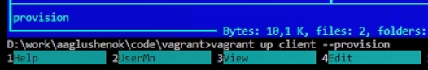{#fig:019 width=60%}

3. После загрузки виртуальной машины client, в ВМ server в файле /var/lib/kea/kea-leases4.csv наблюдаем появление IP-адреса  узла client

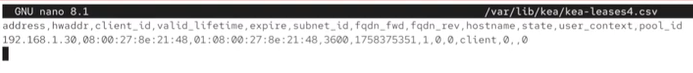{#fig:020 width=60%}

## Настройка обновления DNS-зоны

1. Создадим ключ на сервере с Bind9
2. Поправим права доступа:
3. Подключим ключ в файле /etc/named.conf

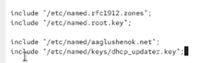{#fig:021 width=60%}

4. На виртуальной машине server отредактируйте файл /etc/named/user.net, разрешив обновление зоны

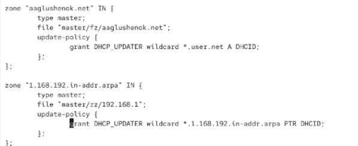{#fig:022 width=60%}

6. Сделаем проверку конфигурационного файла
7. Перезапустите DNS-сервер
8. Сформируем ключ для Kea. Файл ключа назовём /etc/kea/tsig-keys.json:

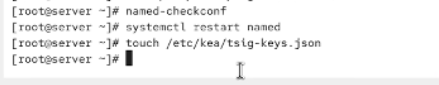{#fig:023 width=60%}

9. Перенесём ключ на сервер Kea DHCP и перепишем его в формате json

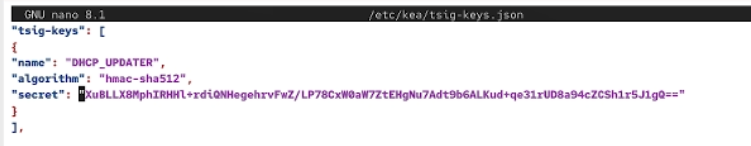{#fig:024 width=60%}

10. Сменим владельца
11. Поправим права доступа

{#fig:025 width=60%}

12. Выполните настройку в файле /etc/kea/kea-dhcp-ddns.conf

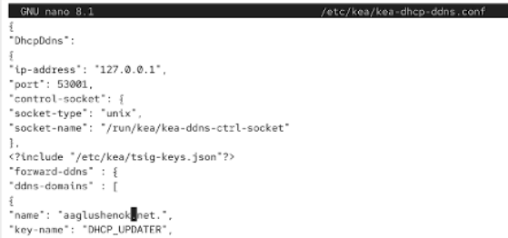{#fig:026 width=60%}

13. Изменим владельца файла
14. Проверим файл на наличие возможных синтаксических ошибок
15. Запустим службу ddns
16. Проверим статус работы службы

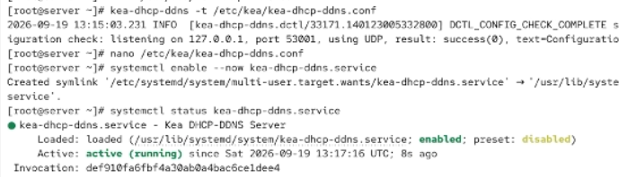{#fig:027 width=60%}

17. Внесите изменения в конфигурационный файл /etc/kea/kea-dhcp4.conf, добавив в него разрешение на динамическое обновление DNS-записей с локального узла прямой и обратной зон

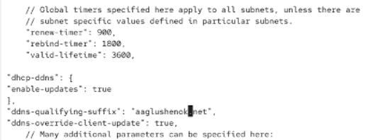{#fig:028 width=60%}

18. Проверим файл на наличие возможных синтаксических ошибок
19. Перезапустите DHCP-сервер
20. Проверим статус

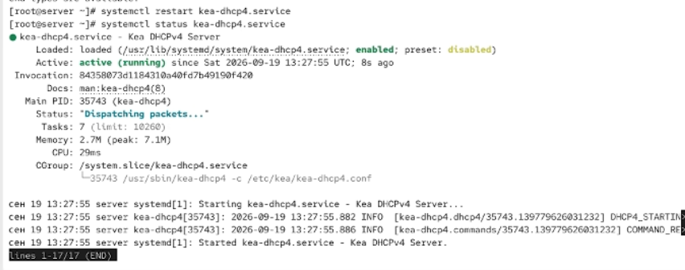{#fig:029 width=60%}

21. На машине client переполучите адрес
22. В каталоге прямой DNS-зоны должен появиться файл user.net.jnl, в котором в бинарном файле автоматически вносятся изменения
записей зоны

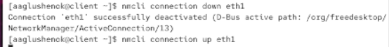{#fig:030 width=60%}

## Внесение изменений в настройки внутреннего окружения виртуальной машины

1. На виртуальной машине server перейдите в каталог /vagrant/provision/server/, создайте в нём
каталог dhcp, поместите конфигурационные файлы DHCP

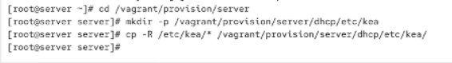{#fig:031 width=60%}

2. Замените конфигурационные файлы DNS-сервера

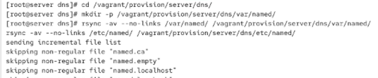{#fig:032 width=60%}

3. В каталоге /vagrant/provision/server создайте исполняемый файл dhcp.sh. Открыв его на редактирование, пропишите скрипт

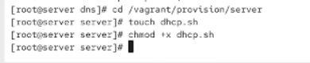{#fig:033 width=60%}

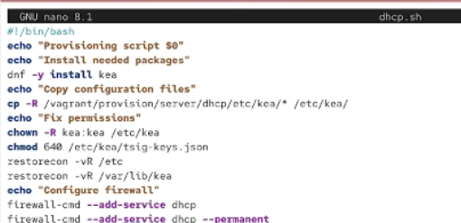{#fig:034 width=60%}

4. Для отработки созданного скрипта во время загрузки виртуальной машины server в конфигурационном файле Vagrantfile необходимо изменить раздел конфигурации для сервера

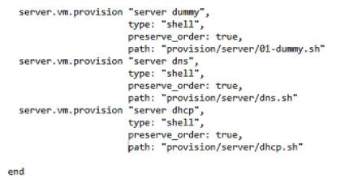{#fig:020 width=60%}

# Выводы

В ходе выполнения лабораторной работы № 3 мне удалось приобрести практические навыки по установке и конфигурированию DHCP-сервера.
