---
## Front matter
lang: ru-RU
title: Лабораторная работа № 4. Базовая настройка HTTP-сервера Apache
subtitle: Презентация
author:
  - Глушенок А. А.
institute:
  - Российский университет дружбы народов, Москва, Россия
date: 25 сентября 2026

## Formatting pdf
toc: false
slide_level: 2
aspectratio: 169
section-titles: true
theme: metropolis
header-includes:
 - \metroset{progressbar=frametitle,sectionpage=progressbar,numbering=fraction}
 - \usepackage{graphicx}
 - \usepackage{caption}
 - \captionsetup{labelformat=empty, labelsep=none}
 
## Fonts
mainfont: Liberation Serif
sansfont: PT Sans
monofont: Liberation Mono
---

## Докладчик

:::::::::::::: {.columns align=center}
::: {.column width="70%"}

  * Глушенок Анна Александровна
  * Студент НПИбд-01-24
  * Факультет физико-математических и естественных наук
  * Российский университет дружбы народов
  * [1132246844@pfur.ru](mailto:1132246844@pfur.ru)
  * <https://github.com/aaglushenok>

:::
::: {.column width="30%"}

:::
::::::::::::::

## Цель работы

Приобретение практических навыков по установке и базовому конфигурированию HTTP-сервера Apache.

## Задание

1. Установите необходимые для работы HTTP-сервера пакеты (см. раздел 4.4.1).
2. Запустите HTTP-сервер с базовой конфигурацией и проанализируйте его работу (см. разделы 4.4.2 и 4.4.3).
3. Настройте виртуальный хостинг (см. раздел 4.4.4).
4. Напишите скрипт для Vagrant, фиксирующий действия по установке и настройке HTTP-сервера во внутреннем окружении виртуальной машины server. Соответствующим образом внесите изменения в Vagrantfile (см. раздел 4.4.5)

# Выполнение лабораторной работы

# Установка HTTP-сервера

## Установка HTTP-сервера

1. Загрузите вашу операционную систему и перейдите в рабочий каталог с проектом
2. Запустите виртуальную машину server

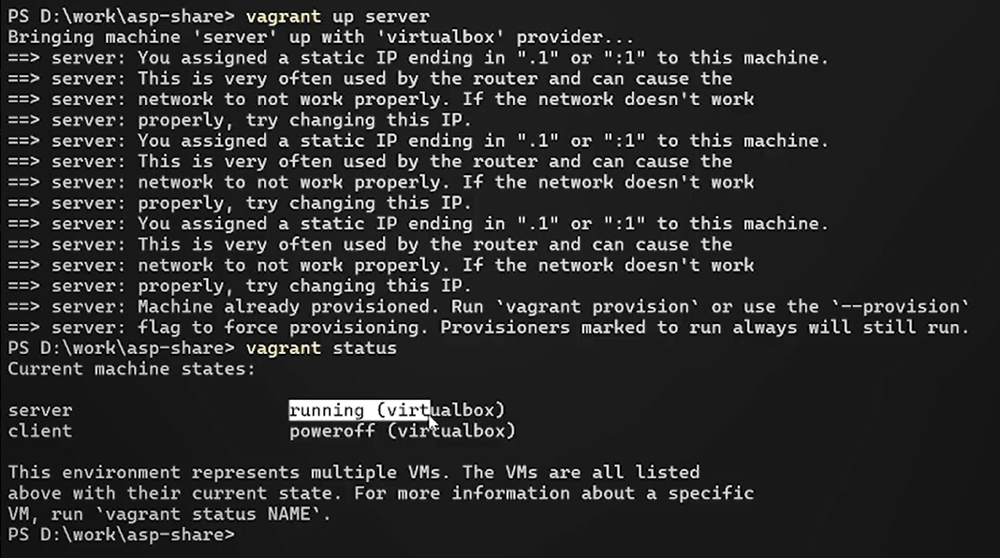{#fig:001 width=60%}

## Установка HTTP-сервера

3. На виртуальной машине server перейдите в режим суперпользователя

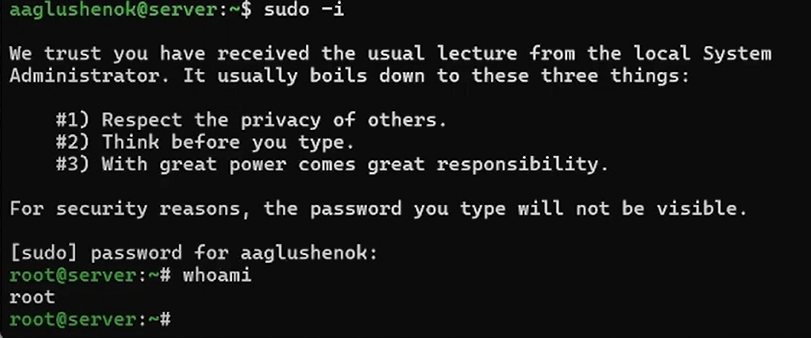{#fig:002 width=60%}

## Установка HTTP-сервера

4. Установите из репозитория стандартный веб-сервер 

{#fig:003 width=60%}

# Базовое конфигурирование HTTP-сервера

## Базовое конфигурирование HTTP-сервера

1. Просмотрите и прокомментируйте в отчёте содержание конфигурационных файлов conf и conf.d

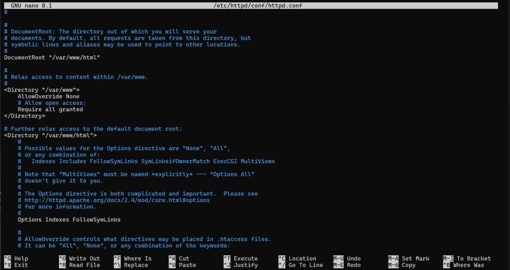{#fig:004 width=60%}

## Базовое конфигурирование HTTP-сервера

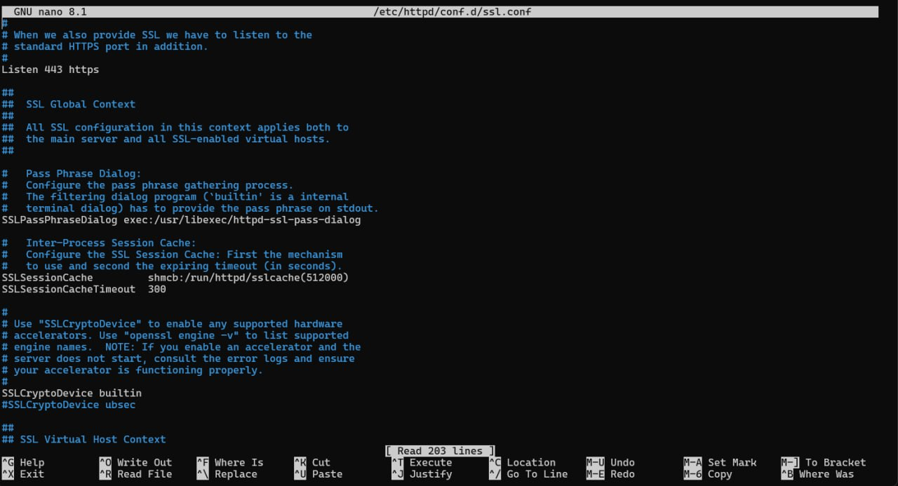{#fig:005 width=60%}

## Базовое конфигурирование HTTP-сервера

2. Внесите изменения в настройки межсетевого экрана узла server, разрешив работу с http

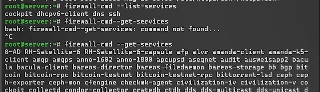{#fig:006 width=60%}

## Базовое конфигурирование HTTP-сервера

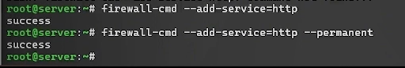{#fig:007 width=60%}

## Базовое конфигурирование HTTP-сервера

3. В дополнительном терминале запустите в режиме реального времени расширенный лог системных сообщений, чтобы проверить корректность работы системы

{#fig:008 width=60%}

## Базовое конфигурирование HTTP-сервера

4. В первом терминале активируйте и запустите HTTP-сервер

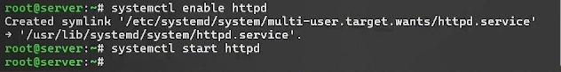{#fig:009 width=60%}

## Базовое конфигурирование HTTP-сервера

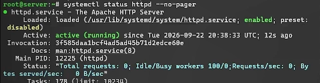{#fig:010 width=60%}

# Анализ работы HTTP-сервера

## Анализ работы HTTP-сервера

1. Запустите виртуальную машину client
2. На виртуальной машине server просмотрите лог ошибок работы веб-сервера
3. На виртуальной машине server запустите мониторинг доступа к веб-серверу

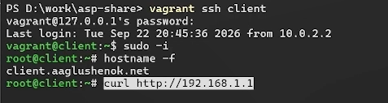{#fig:011 width=60%}

## Анализ работы HTTP-сервера

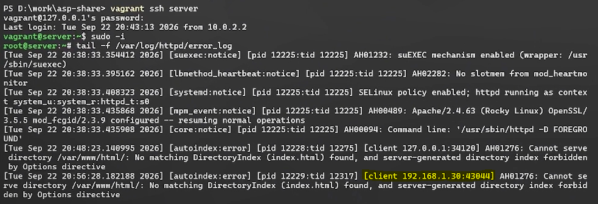{#fig:012 width=60%}

## Анализ работы HTTP-сервера

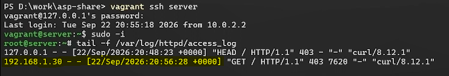{#fig:013 width=60%}

## Анализ работы HTTP-сервера

{#fig:014 width=60%}

# Настройка виртуального хостинга для HTTP-сервера

## Настройка виртуального хостинга для HTTP-сервера

1. Остановите работу DNS-сервера для внесения изменений в файлы описания DNS-зон

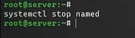{#fig:015 width=60%}

## Настройка виртуального хостинга для HTTP-сервера

2. Добавьте запись для HTTP-сервера в конце файла прямой DNS-зоны и в конце файла обратной зоны. Не забудьте удалить файлы журналов DNS 

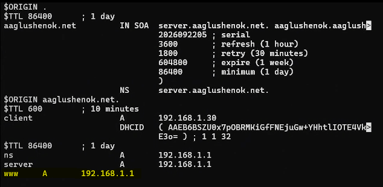{#fig:016 width=60%}

## Настройка виртуального хостинга для HTTP-сервера

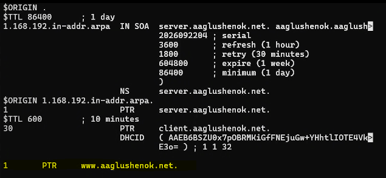{#fig:017 width=60%}

## Настройка виртуального хостинга для HTTP-сервера

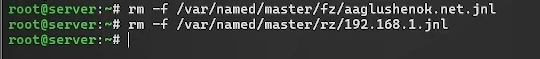{#fig:018 width=60%}

## Настройка виртуального хостинга для HTTP-сервера

3. Перезапустите DNS-сервер

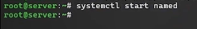{#fig:019 width=60%}

## Настройка виртуального хостинга для HTTP-сервера

4. В каталоге /etc/httpd/conf.d создайте файлы server.user.net.conf и www.user.net.conf

{#fig:020 width=60%}

## Настройка виртуального хостинга для HTTP-сервера

5. Откройте на редактирование файл server.user.net.conf и измените содержание

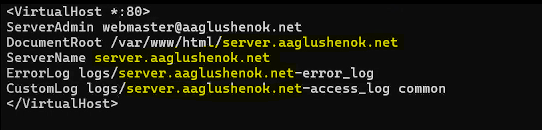{#fig:021 width=60%}

## Настройка виртуального хостинга для HTTP-сервера

6. Откройте на редактирование файл www.user.net.conf и измените содержание

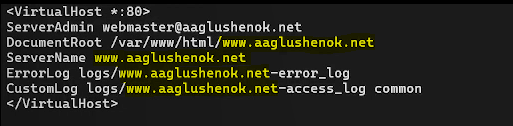{#fig:022 width=60%}

## Настройка виртуального хостинга для HTTP-сервера

7. Перейдите в каталог /var/www/html с содержимым (контентом) веб-серверов, и создайте тестовые страницы для виртуальных веб-серверов server.user.net и www.user.net

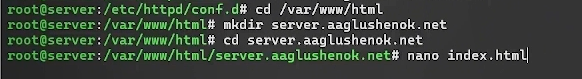{#fig:023 width=60%}

## Настройка виртуального хостинга для HTTP-сервера

{#fig:024 width=60%}

## Настройка виртуального хостинга для HTTP-сервера

{#fig:025 width=60%}

## Настройка виртуального хостинга для HTTP-сервера

{#fig:026 width=60%}

## Настройка виртуального хостинга для HTTP-сервера

8. Скорректируйте права доступа в каталог с веб-контентом

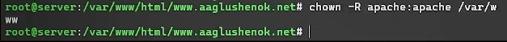{#fig:027 width=60%}

## Настройка виртуального хостинга для HTTP-сервера

9. Восстановите контекст безопасности в SELinux

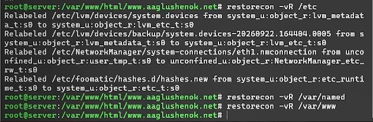{#fig:028 width=60%}

## Настройка виртуального хостинга для HTTP-сервера

10. Перезапустите HTTP-сервер

{#fig:029 width=60%}

## Настройка виртуального хостинга для HTTP-сервера

11. На виртуальной машине client убедитесь в корректном доступе к веб-серверу по адресам server.user.net и www.user.net

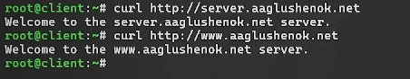{#fig:030 width=60%}

# Внесение изменений в настройки внутреннего окружения виртуальной машины

## Внесение изменений в настройки внутреннего окружения виртуальной машины

1. На ВМ server измените настройки внутреннего окружения, создайте в нём каталог http, поместите в подкаталоги конфигурационные файлы

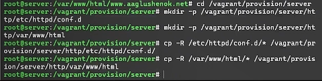{#fig:031 width=60%}

## Внесение изменений в настройки внутреннего окружения виртуальной машины

2. Замените конфигурационные файлы DNS-сервера

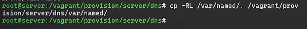{#fig:032 width=60%}

## Внесение изменений в настройки внутреннего окружения виртуальной машины

3. В каталоге /vagrant/provision/server создайте исполняемый файл http.sh. Пропишите в нём скрипт

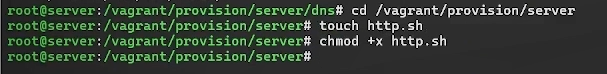{#fig:033 width=60%}

## Внесение изменений в настройки внутреннего окружения виртуальной машины

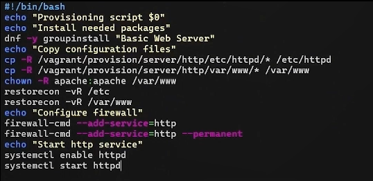{#fig:034 width=60%}

## Внесение изменений в настройки внутреннего окружения виртуальной машины

4. Для отработки скрипта в конфигурационном файле Vagrantfile добавьте запись в конфигурации сервера

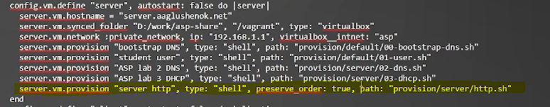{#fig:035 width=60%}

## Внесение изменений в настройки внутреннего окружения виртуальной машины

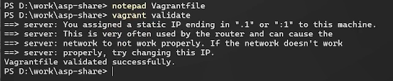{#fig:036 width=60%}

## Выводы

В ходе выполнения лабораторной работы № 4 мне удалось приобрести практические навыки по установке и базовому конфигурированию HTTP-сервера Apache.
