---
## Front matter
lang: ru-RU
title: Лабораторная работа № 5. Расширенная настройка HTTP-сервера Apache
subtitle: Презентация
author:
  - Глушенок А. А.
institute:
  - Российский университет дружбы народов, Москва, Россия
date: 28 сентября 2026

## Formatting pdf
toc: false
slide_level: 2
aspectratio: 169
section-titles: true
theme: metropolis
header-includes:
 - \metroset{progressbar=frametitle,sectionpage=progressbar,numbering=fraction}
 - \usepackage{graphicx}
 - \usepackage{caption}
 - \captionsetup{labelformat=empty, labelsep=none}
 
## Fonts
mainfont: Liberation Serif
sansfont: PT Sans
monofont: Liberation Mono
---

## Докладчик

:::::::::::::: {.columns align=center}
::: {.column width="70%"}

  * Глушенок Анна Александровна
  * Студент НПИбд-01-24
  * Факультет физико-математических и естественных наук
  * Российский университет дружбы народов
  * [1132246844@pfur.ru](mailto:1132246844@pfur.ru)
  * <https://github.com/aaglushenok>

:::
::: {.column width="30%"}

:::
::::::::::::::

## Цель работы

Приобретение практических навыков по расширенному конфигурированию HTTP-сервера Apache в части безопасности и возможности использования PHP.

## Задание

1. Сгенерируйте криптографический ключ и самоподписанный сертификат безопасности для возможности перехода веб-сервера от работы через протокол HTTP к работе через протокол HTTPS (см. раздел 5.4.1).
2. Настройте веб-сервер для работы с PHP (см. раздел 5.4.2).
3. Напишите (или скорректируйте) скрипт для Vagrant, фиксирующий действия по расширенной настройке HTTP-сервера во внутреннем окружении виртуальной машины server (см. раздел 5.4.3)

# Выполнение лабораторной работы

# Конфигурирование HTTP-сервера для работы через протокол HTTPS

## Конфигурирование HTTP-сервера для работы через протокол HTTPS

1. Загрузите вашу операционную систему и перейдите в рабочий каталог с проектом
2. Запустите виртуальную машину server

{#fig:001 width=60%}

## Конфигурирование HTTP-сервера для работы через протокол HTTPS

3. На виртуальной машине server войдите под вашим пользователем, перейдите в режим суперпользователя

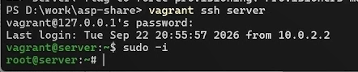{#fig:002 width=60%}

## Конфигурирование HTTP-сервера для работы через протокол HTTPS

4. В каталоге /etc/ssl создайте каталог private. Сгенерируйте ключ и сертификат, заполните сертификат. Сгенерированные ключ и сертификат появятся в каталоге private, скопируйте сертификат в каталог certs

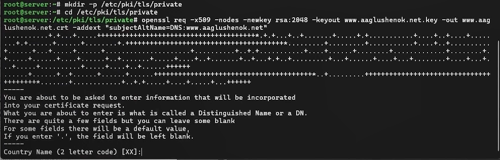{#fig:003 width=60%}

## Конфигурирование HTTP-сервера для работы через протокол HTTPS

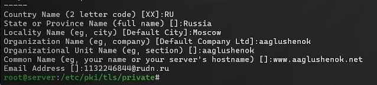{#fig:004 width=60%}

## Конфигурирование HTTP-сервера для работы через протокол HTTPS

{#fig:005 width=60%}

## Конфигурирование HTTP-сервера для работы через протокол HTTPS

5. Для перехода веб-сервера www.user.net на функционирование через протокол HTTPS требуется изменить его конфигурационный файл. Откройте на редактирование файл www.user.net.conf и замените его содержимое 

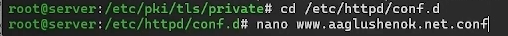{#fig:006 width=60%}

## Конфигурирование HTTP-сервера для работы через протокол HTTPS

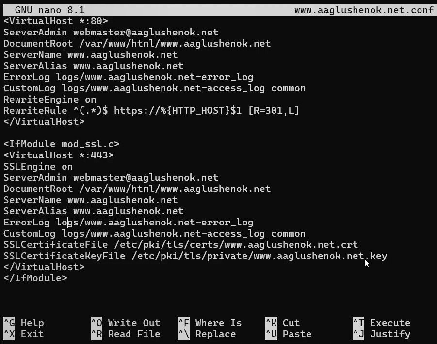{#fig:007 width=40%}

## Конфигурирование HTTP-сервера для работы через протокол HTTPS

6. Внесите изменения в настройки межсетевого экрана на сервере, разрешив работу с https

{#fig:008 width=60%}

## Конфигурирование HTTP-сервера для работы через протокол HTTPS

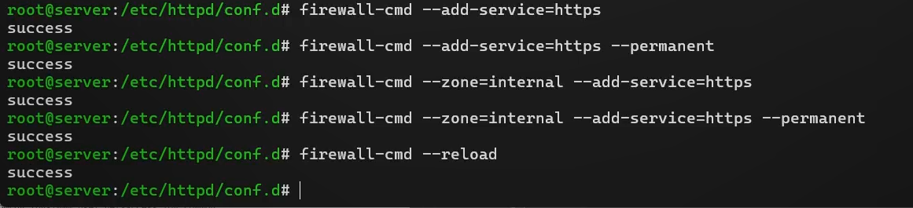{#fig:009 width=60%}

## Конфигурирование HTTP-сервера для работы через протокол HTTPS

7. Перезапустите веб-сервер 

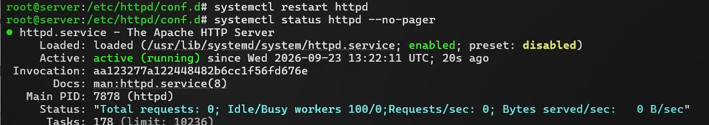{#fig:010 width=60%}

## Конфигурирование HTTP-сервера для работы через протокол HTTPS

8. На ВМclient в строке браузера введите  www.user.net, убедитесь, что произойдёт  переключение на работу по протоколу HTTPS. Затем просмотрите содержание сертификата

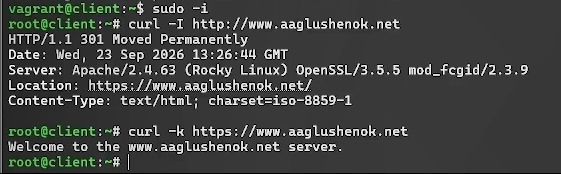{#fig:011 width=60%}

# Конфигурирование HTTP-сервера для работы с PHP

## Конфигурирование HTTP-сервера для работы с PHP

1. Установите пакеты для работы с PHP

{#fig:012 width=60%}

## Конфигурирование HTTP-сервера для работы с PHP

2. В каталоге /var/www/html/www.user.net замените index.html на index.php (содержание указано в матриалах)
3. Скорректируйте права доступа в каталог с веб-контентом

{#fig:013 width=60%}

## Конфигурирование HTTP-сервера для работы с PHP

4. Восстановите контекст безопасности в SELinux
5. Перезапустите HTTP-сервер

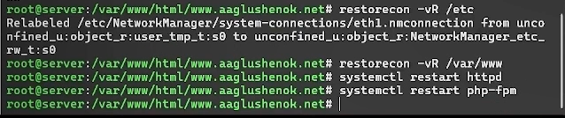{#fig:014 width=60%}

## Конфигурирование HTTP-сервера для работы с PHP

6. На ВМ client в строке браузера введите название веб-сервера и убедитесь, что будет выведена страница с информацией об используемой версии PHP

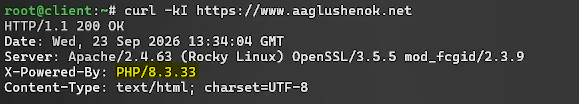{#fig:015 width=60%}

# Внесение изменений в настройки внутреннего окружения виртуальной машины

## Внесение изменений в настройки внутреннего окружения виртуальной машины

1. На виртуальной машине server перейдите в каталог для внесения изменений в настройки внутреннего окружения /vagrant/provision/server/http и в соответствующие каталоги скопируйте конфигурационные файлы

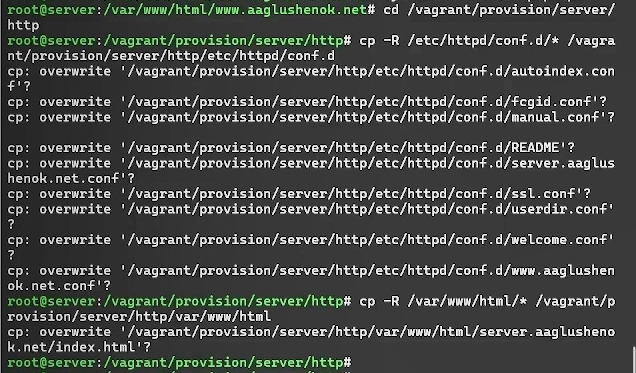{#fig:016 width=40%}

## Внесение изменений в настройки внутреннего окружения виртуальной машины

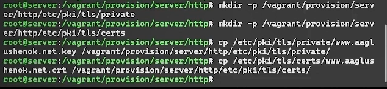{#fig:017 width=60%}

## Внесение изменений в настройки внутреннего окружения виртуальной машины

2. В имеющийся скрипт /vagrant/provision/server/http.sh внесите изменения, добавив установку PHP и настройку межсетевого экрана, разрешающую работать с https

{#fig:018 width=60%}

## Внесение изменений в настройки внутреннего окружения виртуальной машины

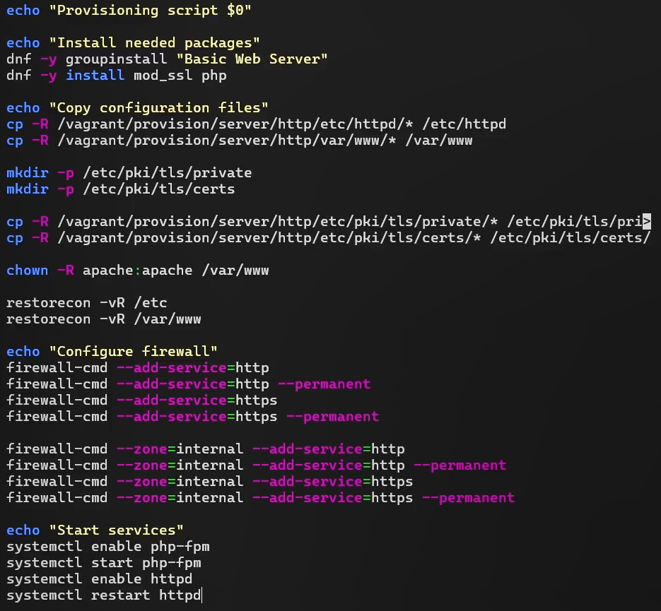{#fig:019 width=40%}

## Внесение изменений в настройки внутреннего окружения виртуальной машины

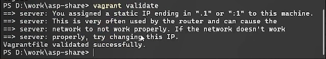{#fig:020 width=60%}

## Выводы

В ходе выполнения лабораторной работы № 5 мне удалось приобрести практические навыки по расширенному конфигурированию HTTP-сервера Apache в части безопасности и возможности использования PHP.
