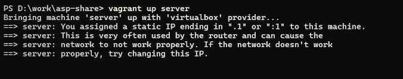
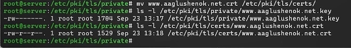
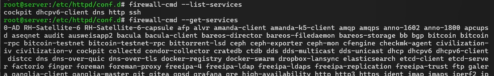
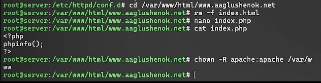
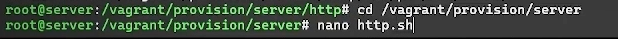

# Цель работы

Приобретение практических навыков по расширенному конфигурированию
HTTP-сервера Apache в части безопасности и возможности использования
PHP.

# Задание

1.  Сгенерируйте криптографический ключ и самоподписанный сертификат
    безопасности для возможности перехода веб-сервера от работы через
    протокол HTTP к работе через протокол HTTPS (см. раздел 5.4.1).
2.  Настройте веб-сервер для работы с PHP (см. раздел 5.4.2).
3.  Напишите (или скорректируйте) скрипт для Vagrant, фиксирующий
    действия по расширенной настройке HTTP-сервера во внутреннем
    окружении виртуальной машины server (см. раздел 5.4.3)

# Выполнение лабораторной работы

## Конфигурирование HTTP-сервера для работы через протокол HTTPS

1.  Загрузите вашу операционную систему и перейдите в рабочий каталог с
    проектом
2.  Запустите виртуальную машину server

{#fig:001 width="60%"}

3.  На виртуальной машине server войдите под вашим пользователем,
    перейдите в режим суперпользователя

{#fig:002 width="60%"}

4.  В каталоге /etc/ssl создайте каталог private. Сгенерируйте ключ и
    сертификат, заполните сертификат. Сгенерированные ключ и сертификат
    появятся в каталоге private, скопируйте сертификат в каталог certs

{#fig:003
width="60%"}

{#fig:004 width="60%"}

{#fig:005
width="60%"}

5.  Для перехода веб-сервера www.user.net на функционирование через
    протокол HTTPS требуется изменить его конфигурационный файл.
    Откройте на редактирование файл www.user.net.conf и замените его
    содержимое

{#fig:006 width="60%"}

{#fig:007 width="60%"}

Комментарий к содержимому файла: Файл конфигурации веб-сервера Apache
описывает два виртуальных хоста для домена www.aaglushenok.net, где
первый блок для порта 80 принимает обычный HTTP-трафик и с помощью
правила RewriteRule принудительно перенаправляет всех посетителей на
защищенную версию сайта, а второй блок внутри условия IfModule для порта
443 настраивает работу по протоколу HTTPS, указывая пути к
SSL-сертификату и приватному ключу, а также задавая общие для обоих
блоков параметры, такие как корневая директория документов
/var/www/html/www.aaglushenok.net, административный email и пути к логам
ошибок и доступа.

6.  Внесите изменения в настройки межсетевого экрана на сервере,
    разрешив работу с https

{#fig:008
width="60%"}

{#fig:009
width="60%"}

7.  Перезапустите веб-сервер

{#fig:010 width="60%"}

8.  На ВМclient в строке браузера введите www.user.net, убедитесь, что
    произойдёт переключение на работу по протоколу HTTPS. Затем
    просмотрите содержание сертификата

{#fig:011 width="60%"}

## Конфигурирование HTTP-сервера для работы с PHP

1.  Установите пакеты для работы с PHP

{#fig:012
width="60%"}

2.  В каталоге /var/www/html/www.user.net замените index.html на
    index.php (содержание указано в матриалах)
3.  Скорректируйте права доступа в каталог с веб-контентом

{#fig:013
width="60%"}

4.  Восстановите контекст безопасности в SELinux
5.  Перезапустите HTTP-сервер

{#fig:014 width="60%"}

6.  На ВМ client в строке браузера введите название веб-сервера и
    убедитесь, что будет выведена страница с информацией об используемой
    версии PHP

{#fig:015 width="60%"}

## Внесение изменений в настройки внутреннего окружения виртуальной машины

1.  На виртуальной машине server перейдите в каталог для внесения
    изменений в настройки внутреннего окружения
    /vagrant/provision/server/http и в соответствующие каталоги
    скопируйте конфигурационные файлы

{#fig:016 width="60%"}

{#fig:017 width="60%"}

2.  В имеющийся скрипт /vagrant/provision/server/http.sh внесите
    изменения, добавив установку PHP и настройку межсетевого экрана,
    разрешающую работать с https

{#fig:018
width="60%"}

{#fig:019
width="60%"}

{#fig:020 width="60%"}

# Выводы

В ходе выполнения лабораторной работы № 5 мне удалось приобрести
практические навыки по расширенному конфигурированию HTTP-сервера Apache
в части безопасности и возможности использования PHP.
