---
## Front matter
title: "Лабораторная работа № 1. Подготовка лабораторного стенда."
subtitle: "Отчет"
author: "Анна Александровна Глушенок"

## Generic options
lang: ru-RU
toc-title: "Содержание"

## Pdf output format
toc: true
toc-depth: 2
lof: true
lot: false
fontsize: 12pt
linestretch: 1.5
papersize: a4
documentclass: scrreprt

## I18n babel
babel-lang: russian
babel-otherlangs: english

## Fonts
mainfont: Liberation Serif
sansfont: Liberation Sans
monofont: Liberation Mono

## Pandoc-crossref LaTeX customization
figureTitle: "Рис."
tableTitle: "Таблица"
lofTitle: "Список иллюстраций"

## Misc options
indent: true
header-includes:
  - \usepackage{indentfirst}
  - \usepackage{float}
  - \floatplacement{figure}{H}
---

# Цель работы

Целью данной работы является приобретение практических навыков установки Rocky Linux на виртуальную машину с помощью инструмента Vagrant.

# Выполнение лабораторной работы

1. Устанавливаем Vagrant — инструмент для создания и управления средами виртуальных машин в одном рабочем процессе.

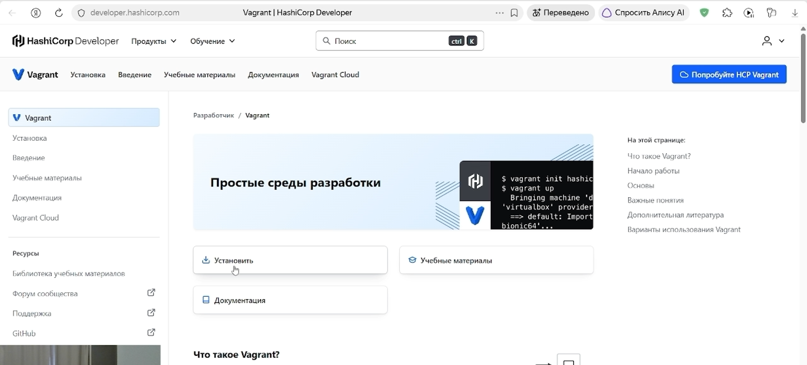{#fig:001 width=80%}

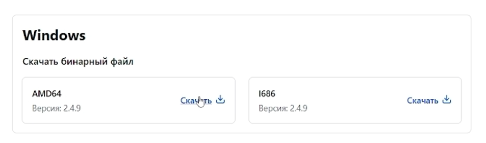{#fig:002 width=80%}

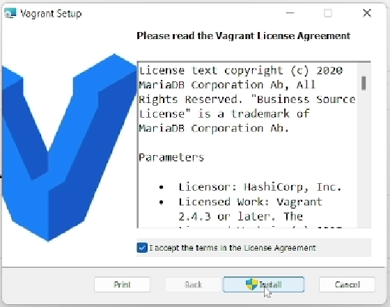{#fig:003 width=80%}

2. Дополнительно устанавливаем Packer и FAR для удобства работы в терминале.

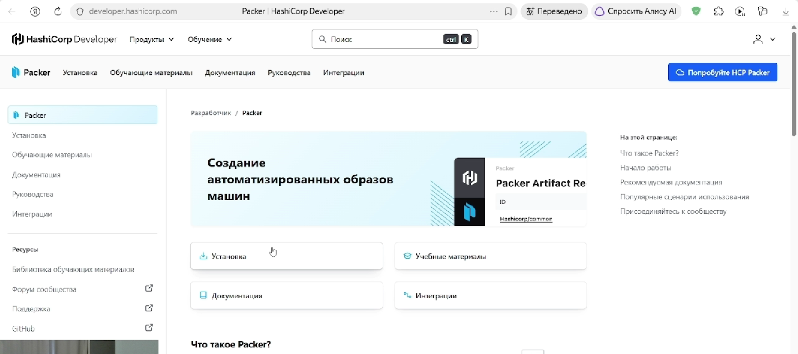{#fig:004 width=80%}

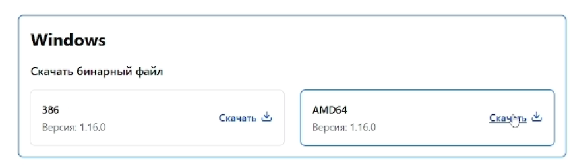{#fig:005 width=80%}

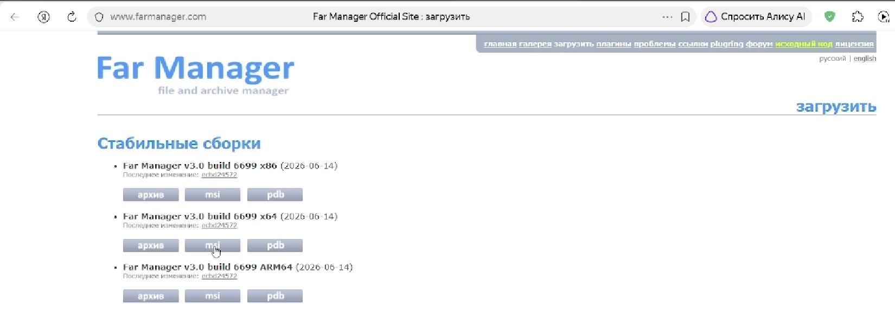{#fig:006 width=80%}

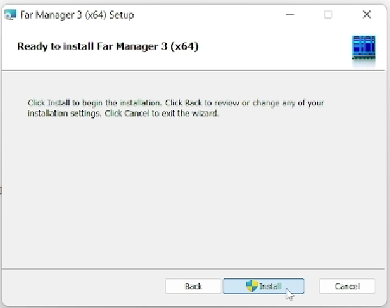{#fig:007 width=80%}

3. Устанавливаем Rocky Linux 10 Minimal ISO

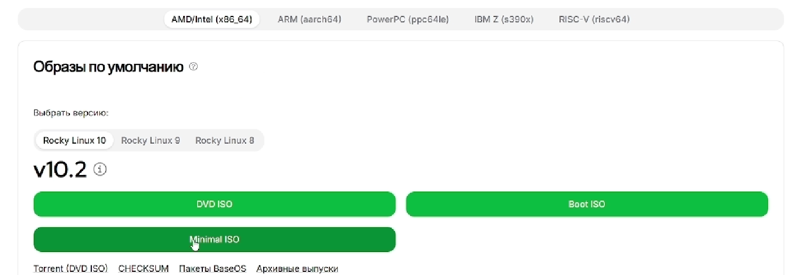{#fig:008 width=80%}

После завершения всех установок общий список загруженных файлов, необходимых дляработы, выглядит следующим образом

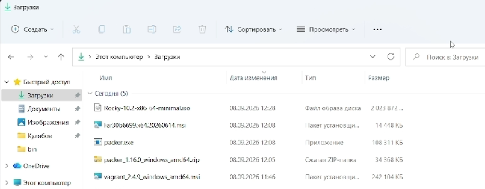{#fig:009 width=80%}

4. В ОС Windows создаем рабочий каталог aaglushenok

{#fig:010 width=80%}

5. Переходим к курсу "Администрирование сетевых подсистем" в ТУИС, в материалах к первой лабораторной работе открываем сслыку на репозиторий GitHub. Скачиваем ZIP-архив, распаковываем его в созданный для работы каталог aaglushenok. 

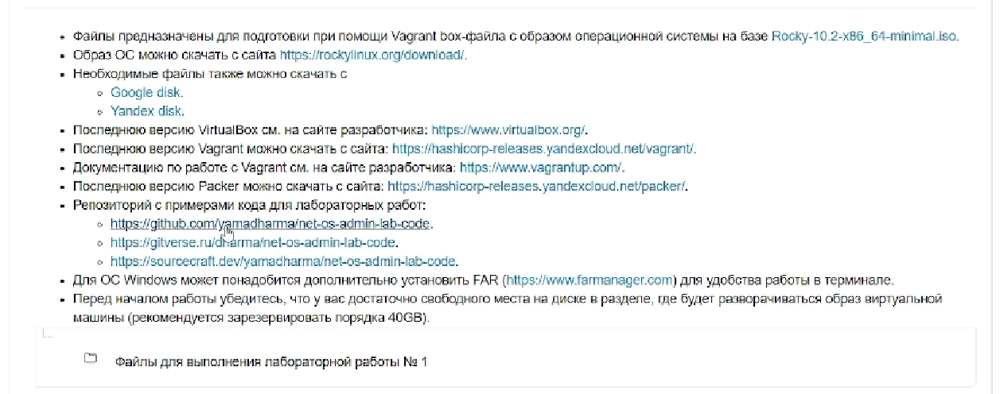{#fig:011 width=80%}

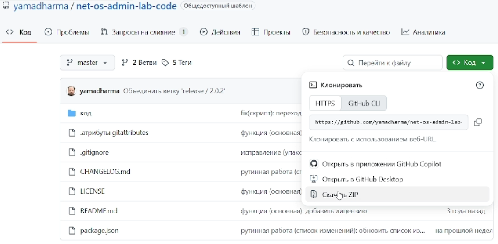{#fig:012 width=80%}

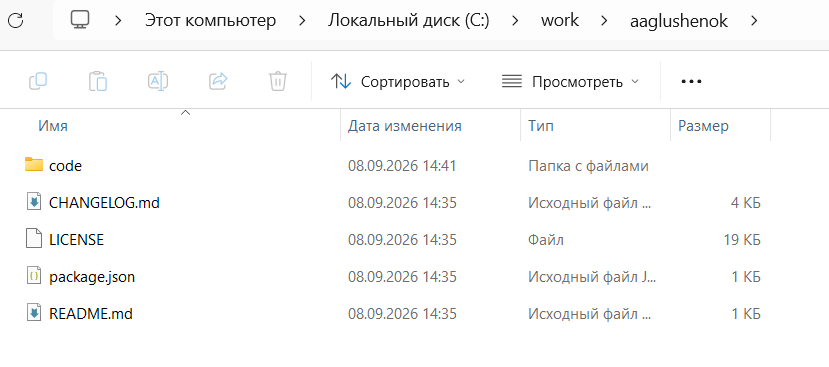{#fig:013 width=80%}

6. В каталог packer переносим ранее установленные файлы: Rocky Linux 10 Minimal ISO, и packer.exe

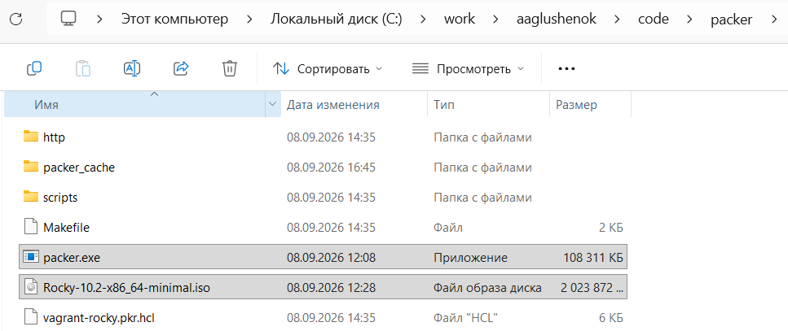{#fig:014 width=80%}

7. В файлах 01-hostname, и 01-user заменяем "user" на свой логин - "aaglushenok"

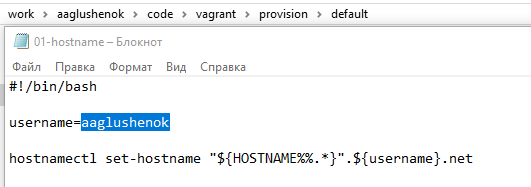{#fig:015 width=80%}

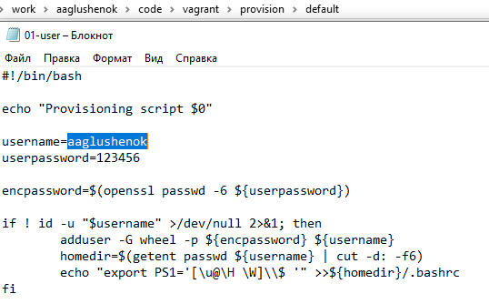{#fig:016 width=80%}

8. Используя FAR, перейдите в  рабочий каталог, введите команды для начала автоматической установки образа операционной системы Rocky Linux в VirtualBox. По окончании процесса в рабочем каталоге сформируется box-файл

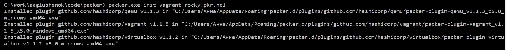{#fig:017 width=80%}

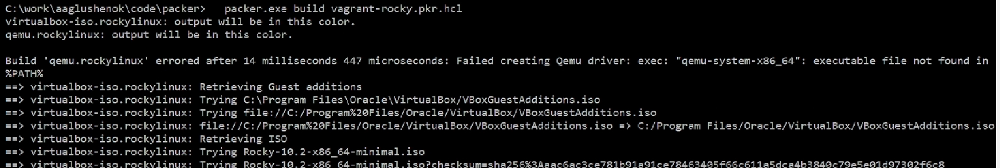{#fig:018 width=80%}

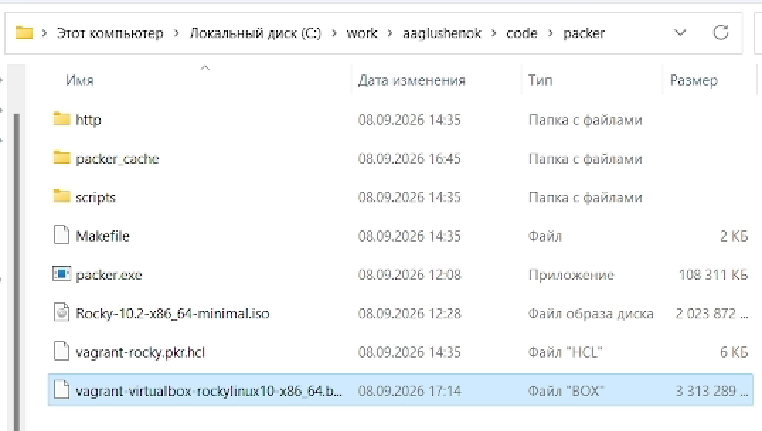{#fig:019 width=80%}

9. Для регистрации образа виртуальной машины в vagrant в командной строке введите vagrant box add rockylinux10 vagrant-virtualbox-rockylinux10-x86_64.box

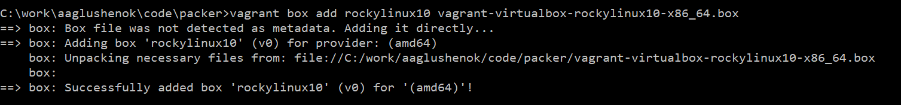{#fig:020 width=80%}

10. Для запуска виртуальной машины Server введите в консоли vagrant up server (делаем дважды, тк в первый раз предлагается установка плагина). После выполнения в VirtualBox появляется машина "vagrant_server_..."

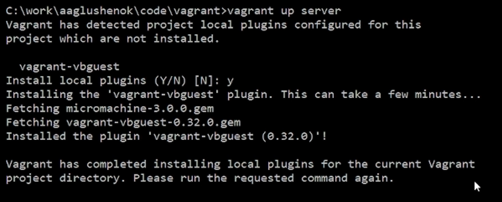{#fig:021 width=80%}

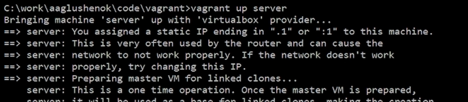{#fig:022 width=80%}

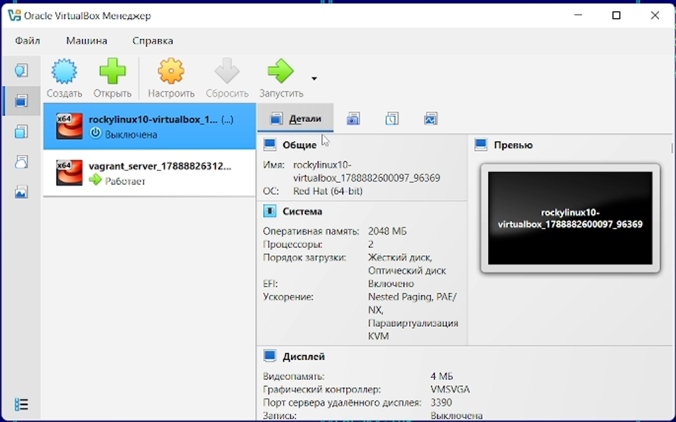{#fig:023 width=80%}

11. Для запуска виртуальной машины Client введите в консоли vagrant up client. После выполнения в VirtualBox появляется машина "vagrant_client_..."

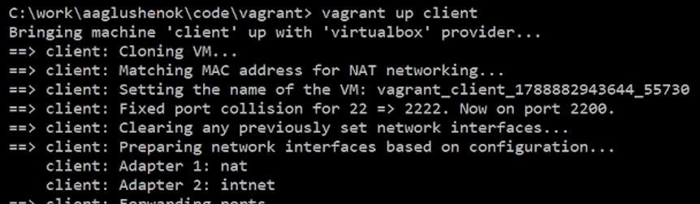{#fig:024 width=80%}

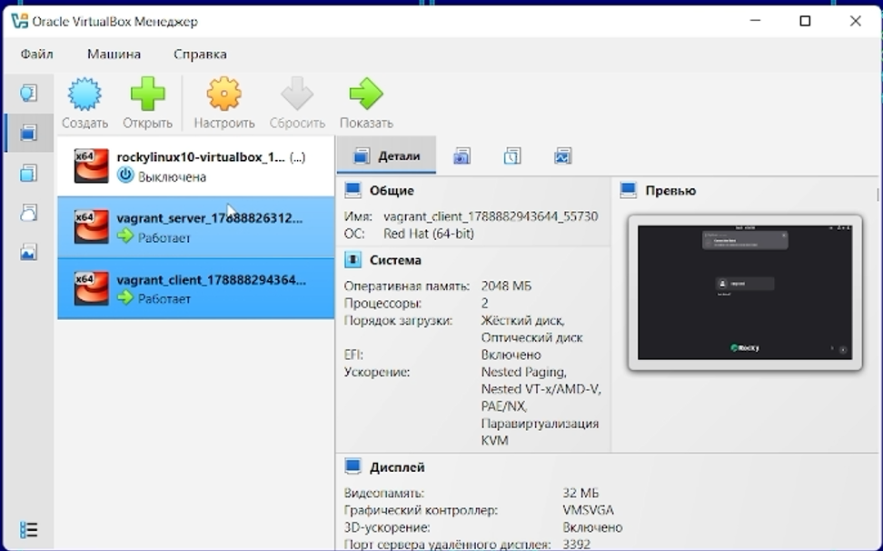{#fig:025 width=80%}

12. Убедитесь, что запуск обеих виртуальных машин прошёл успешно, залогиньтесь под пользователем vagrant с паролем vagrant в графическом окружении (проделываем для каждой из двух машин)

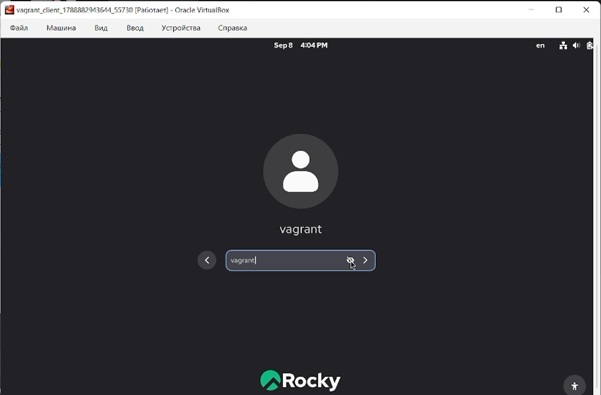{#fig:026 width=80%}

13. Подключитесь к серверу из консоли: vagrant ssh server
14. Введите пароль vagrant.
15. Перейдите к пользователю user (вместо user должен быть указан ваш логин): su - user
16. Отлогиньтесь.

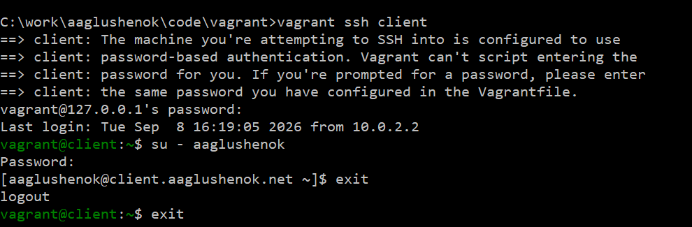{#fig:027 width=80%}

17. Выполните тоже самое для клиента.

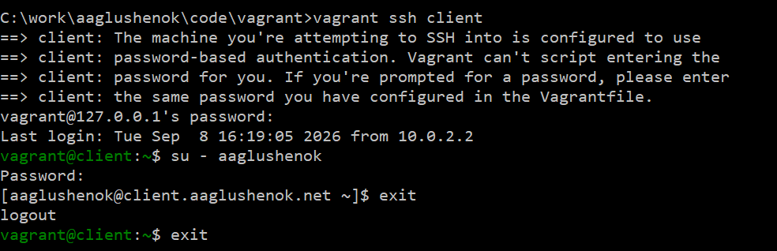{#fig:028 width=80%}

18. Выключите обе виртуальные машины

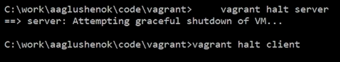{#fig:029 width=80%}

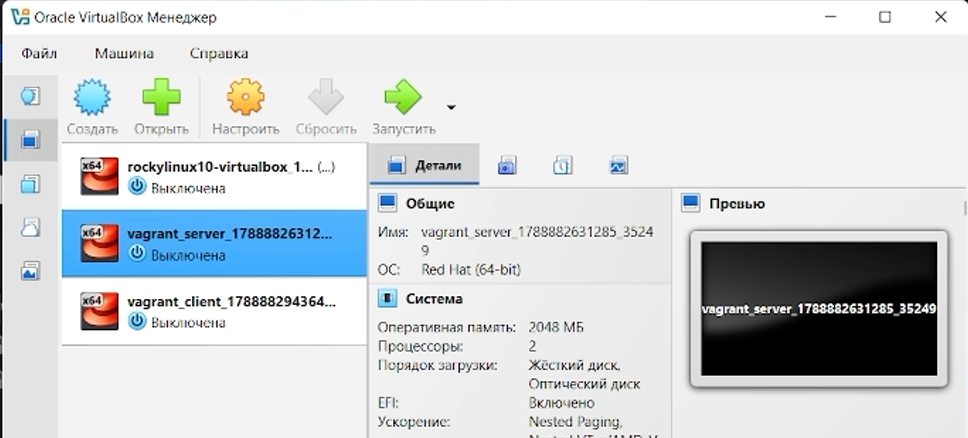{#fig:030 width=80%}

# Выводы

В ходе выполнения лабораторной работы № 1 мне удалось приобрести  практические навыки установки Rocky Linux на виртуальную машину с помощью инструмента Vagrant.
