---
## Front matter
lang: ru-RU
title: Лабораторная работа № 2. Настройка DNS-сервера.
subtitle: Презентация
author:
  - Глушенок А. А.
institute:
  - Российский университет дружбы народов, Москва, Россия
date: 12 сентября 2026

## Formatting pdf
toc: false
slide_level: 2
aspectratio: 169
section-titles: true
theme: metropolis
header-includes:
 - \metroset{progressbar=frametitle,sectionpage=progressbar,numbering=fraction}
 - \usepackage{graphicx}
 - \usepackage{caption}
 - \captionsetup{labelformat=empty, labelsep=none}
 
## Fonts
mainfont: Liberation Serif
sansfont: PT Sans
monofont: Liberation Mono
---

## Докладчик

:::::::::::::: {.columns align=center}
::: {.column width="70%"}

  * Глушенок Анна Александровна
  * Студент НПИбд-01-24
  * Факультет физико-математических и естественных наук
  * Российский университет дружбы народов
  * [1132246844@pfur.ru](mailto:1132246844@pfur.ru)
  * <https://github.com/aaglushenok>

:::
::: {.column width="30%"}

:::
::::::::::::::

## Цель работы

Приобретение практических навыков по установке и конфигурированию DNS-сервера, усвоение принципов работы системы доменных имён.

## Установка DNS-сервера

1. Запустите виртуальную машину server:

{#fig:001 width=60%}

## Установка DNS-сервера

2. Перейдите в режим суперпользователя

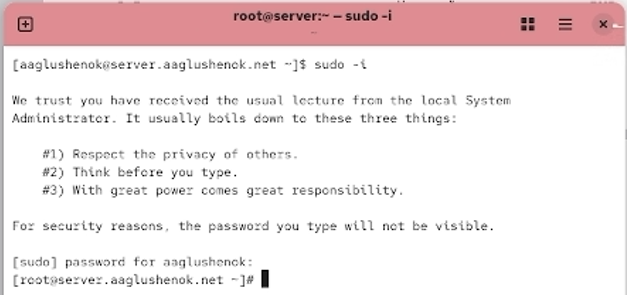{#fig:002 width=60%}

## Установка DNS-сервера

3. Установите bind и bind-utils

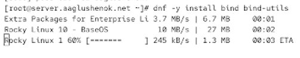{#fig:003 width=60%}

## Установка DNS-сервера

4. С помощью утилиты dig сделайте запрос, например, к DNS-адресу www.yandex.ru:

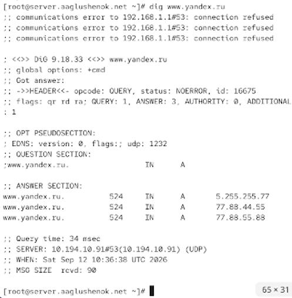{#fig:004 width=60%}

## Конфигурирование кэширующего DNS-сервера при отсутствии фильтрации DNS-запросов маршрутизаторами

1. В отчёте проанализируйте построчно содержание файлов. 

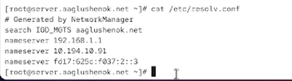{#fig:005 width=60%}

## Конфигурирование кэширующего DNS-сервера при отсутствии фильтрации DNS-запросов маршрутизаторами

2. Запустите DNS-сервер
3. Включите запуск DNS-сервера в автозапуск при загрузке системы

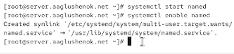{#fig:006 width=60%}

## Конфигурирование кэширующего DNS-сервера при отсутствии фильтрации DNS-запросов маршрутизаторами

4. Проанализируйте в отчёте отличие в выведенной на экран информации при выполнении команд dig www.yandex.ru
и dig @127.0.0.1 www.yandex.ru

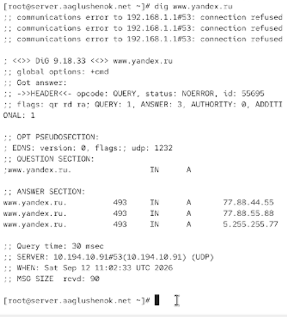{#fig:007 width=60%}

## Конфигурирование кэширующего DNS-сервера при отсутствии фильтрации DNS-запросов маршрутизаторами

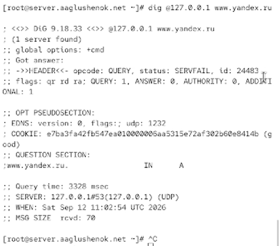{#fig:008 width=60%}

## Конфигурирование кэширующего DNS-сервера при отсутствии фильтрации DNS-запросов маршрутизаторами

5. Сделайте DNS-сервер сервером по умолчанию для хоста server и внутренней вир-
туальной сети

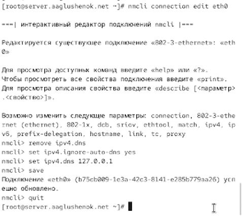{#fig:009 width=60%}

## Конфигурирование кэширующего DNS-сервера при отсутствии фильтрации DNS-запросов маршрутизаторами

6. Перезапустите NetworkManager, Проверьте наличие изменений в файле /etc/resolv.conf.

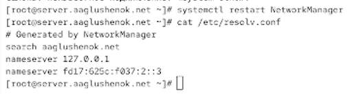{#fig:010 width=60%}

## Конфигурирование кэширующего DNS-сервера при отсутствии фильтрации DNS-запросов маршрутизаторами

7. Требуется настроить направление DNS-запросов от всех узлов внутренней сети, включая запросы от узла server, через узел server. Для этого внесите изменения в файл /etc/named.conf

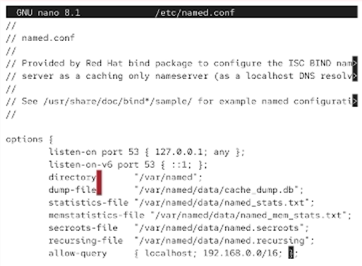{#fig:011 width=60%}

## Конфигурирование кэширующего DNS-сервера при отсутствии фильтрации DNS-запросов маршрутизаторами

8. . Внесите изменения в настройки межсетевого экрана узла server, разрешив работу с DNS

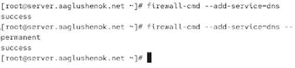{#fig:012 width=60%}

## Конфигурирование кэширующего DNS-сервера при отсутствии фильтрации DNS-запросов маршрутизаторами

9. Убедитесь, что DNS-запросы идут через узел server, который прослушивает порт 53

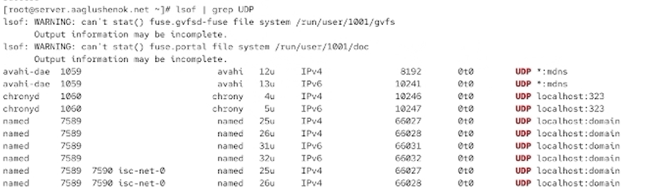{#fig:013 width=60%}

## Конфигурирование первичного DNS-сервера

1. Скопируйте шаблон описания DNS-зон named.rfc1912.zones из каталога /etc в ка-
талог /etc/named и переименуйте его в user.net 

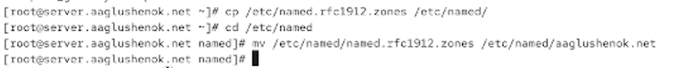{#fig:014 width=60%}

## Конфигурирование первичного DNS-сервера

2. Включите файл описания зоны /etc/named/user.net в конфигурационном файле DNS /etc/named.conf

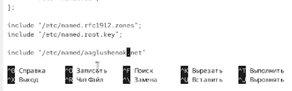{#fig:015 width=60%}

## Конфигурирование первичного DNS-сервера

3. Откройте файл /etc/named/user.net на редактирование

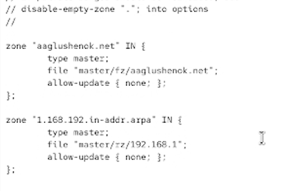{#fig:016 width=60%}

## Конфигурирование первичного DNS-сервера

4. В каталоге /var/named создайте подкаталоги master/fz и master/rz, в которых будут располагаться файлы прямой и обратной зоны соответственно

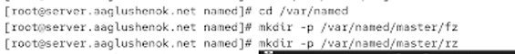{#fig:017 width=60%}

## Конфигурирование первичного DNS-сервера

5. Скопируйте шаблон прямой DNS-зоны named.localhost из каталога /var/named в каталог /var/named/master/fz и переименуйте его в user.net 

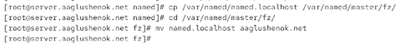{#fig:018 width=60%}

## Конфигурирование первичного DNS-сервера

6. Измените файл /var/named/master/fz/user.net

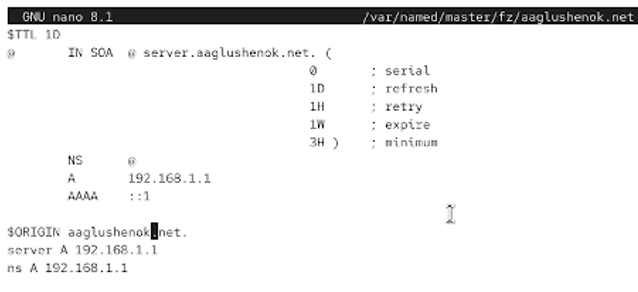{#fig:019 width=60%}

## Конфигурирование первичного DNS-сервера

7. Скопируйте шаблон обратной DNS-зоны named.loopback из каталога /var/named в каталог /var/named/master/rz и переименуйте его в 192.168.1
8. Измените файл /var/named/master/rz/192.168.1

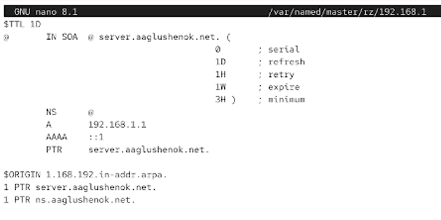{#fig:020 width=60%}

## Конфигурирование первичного DNS-сервера

9. Далее требуется исправить права доступа к файлам в каталогах /etc/named и /var/named, чтобы демон named мог с ними р10. После изменения доступа к конфигурационным файлам named требуется корректно восстановить их метки в SELinuxаботать
10. После изменения доступа к конфигурационным файлам named требуется корректно восстановить их метки в SELinux. Для проверки состояния переключателей SELinux, относящихся к named, введите: getsebool -a | grep named. При необходимости дайте named разрешение на запись в файлы DNS-зоны:

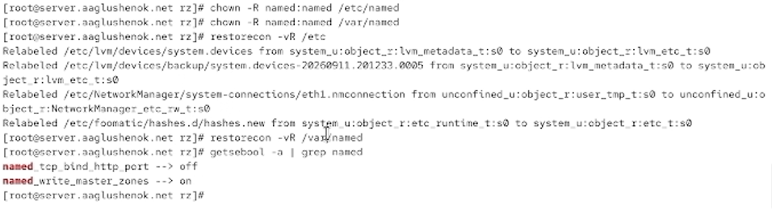{#fig:021 width=60%}

## Конфигурирование первичного DNS-сервера

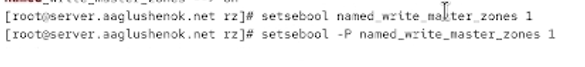{#fig:022 width=60%}

## Анализ работы DNS-серверf

1. При помощи утилиты dig получите описание DNS-зоны с сервера ns.user.net
2. При помощи утилиты host проанализируйте корректность работы DNS-сервера

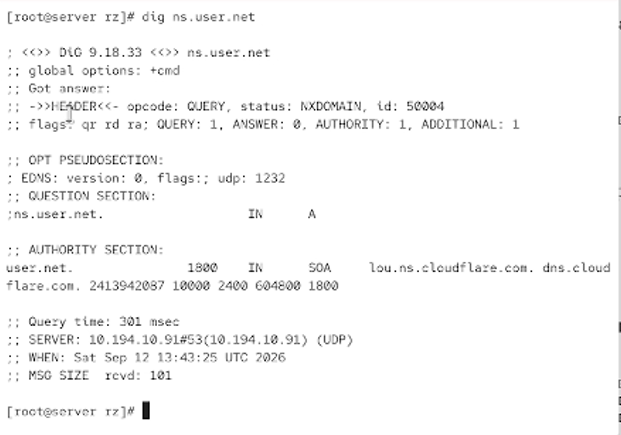{#fig:023 width=60%}

## Анализ работы DNS-серверf

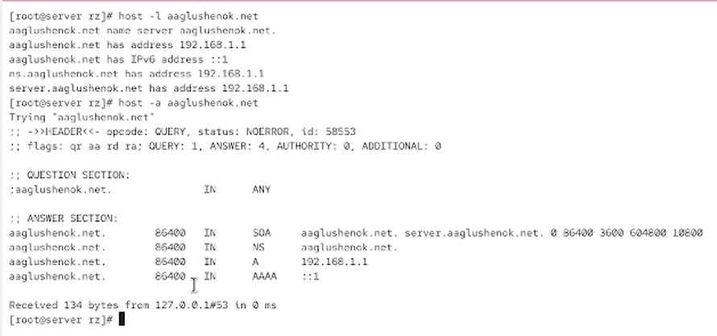{#fig:024 width=60%}

## Анализ работы DNS-серверf

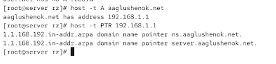{#fig:025 width=60%}

## Внесение изменений в настройки внутреннего окружения виртуальной машины

1. На виртуальной машине server перейдите в каталог для внесения изменений в настройки внутреннего окружения /vagrant/provision/server/, создайте в нём каталог dns, в который поместите в соответствующие каталоги конфигурационные файлы DNS

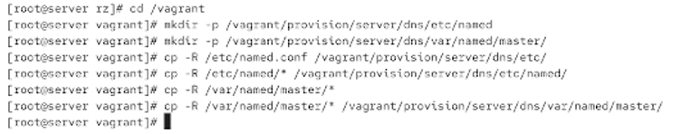{#fig:026 width=60%}

## Внесение изменений в настройки внутреннего окружения виртуальной машины

2. В каталоге /vagrant/provision/server создайте исполняемый файл dns.sh

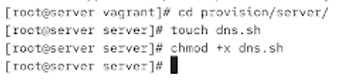{#fig:027 width=60%}

## Внесение изменений в настройки внутреннего окружения виртуальной машины

3. Для отработки созданного скрипта во время загрузки виртуальной машины server в конфигурационном файле Vagrantfile необходимо добавить в разделе конфигурации для сервера

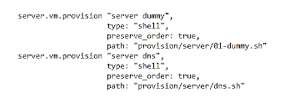{#fig:028 width=60%}

## Выводы

В ходе выполнения лабораторной работы № 2 мне удалось  прибрести практические навыки по установке и конфигурированию DNS-сервера, усвоение принципов работы системы доменных имён.
